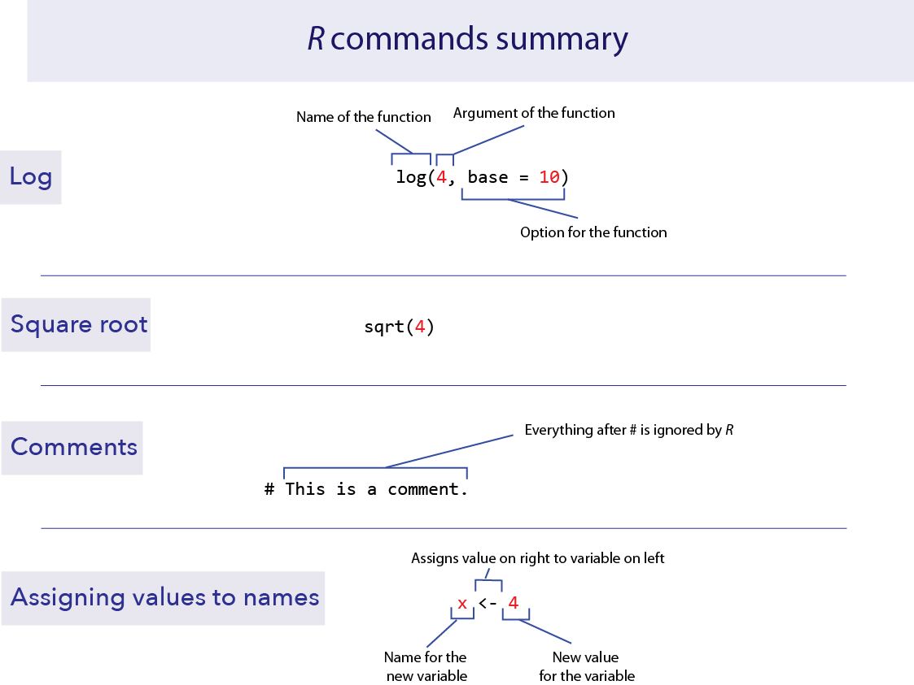

```{r setup, include=FALSE}
knitr::opts_chunk$set(echo = FALSE)
```


## Why R and RStudio?

- It is free and open-source (unlike Minitab or Excel)

- It runs on many desktop platforms (Mac, PC, Unix, Linux)

- There are lots (> 10,000) of packages available to increase functionality (https://cran.r-project.org/web/packages/available_packages_by_name.html)

- It runs many different statistical tests (far more powerful than Minitab or Excel)

- R lets you automate data processing

- It enforces scientific reproducibility because analyses are specified using
a scripting language that fully documents all of the steps

- Once you learn the language, it will save you lots of time

- R is a valuable skill that will increase or employability after graduation


## What is the difference between R and RStudio?

- **R** is a programming language that can be used to perform data processing
and analyses, and to create graphs.

\hfill

- **RStudio** is a separate program that provides a "front end" to R. It makes
using R easier by organising commands, scripts, graphics, help, etc. as separate
windows.


## There are lots of great resources available


- Companion to the Analysis of Biological Data (Whitlock and Schluter)
https://whitlockschluter3e.zoology.ubc.ca/RLabs/index.html


- Data to Viz (for lots of plots with accompanying code)
  + https://r-graph-gallery.com/index.html


- Harvard free courses
  + https://pll.harvard.edu/subject/r


- Sofware carpentry 
  + http://swcarpentry.github.io/r-novice-inflammation/


## R involves specifying arguments to functions and assigning outputs to objects

```{r, echo=FALSE, out.width="10cm"}

```

\tiny source: https://whitlockschluter3e.zoology.ubc.ca/RLabs/R_tutorial_Intro_to_R_1.html


